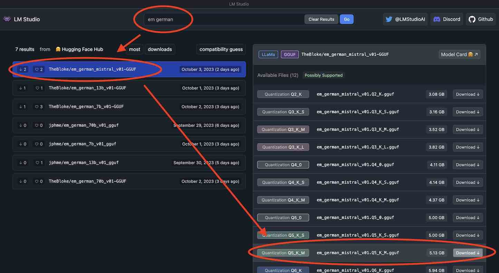
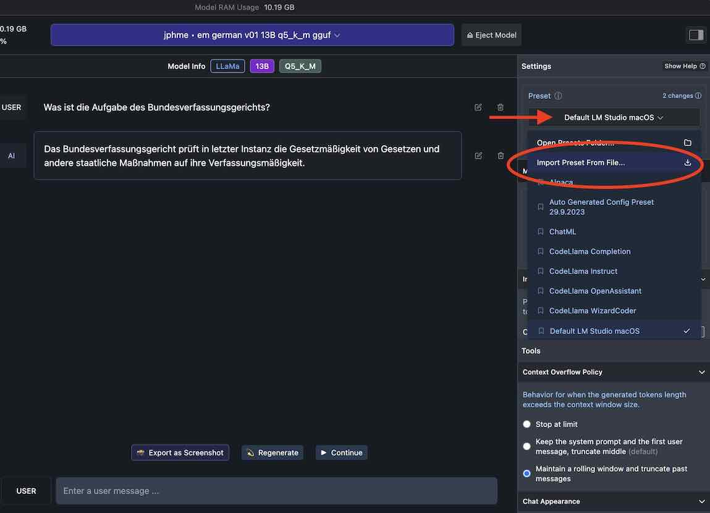

# Anleitung: Das offene *EM German* KI-Modell mit LM Studio nutzen

1. LM Studio unter [diesem Link](https://lmstudio.ai/) herunterladen.
2. Die Konfigurationsdatei [hier](lm_studio_em_german.preset.json) herunterladen (falls sich ein Text-Fenster öffnet mit Rechtsklick -> "Speichern unter")
3. LM Studie starten und das Model downloaden (siehe Bild unten). Ich empfehle das "em_german_mistral_v01-GGUF" Modell in der "Q5_K_M" Variante (ca. 5GB) zu verwenden. Sollte Ihr Rechner nur 8 GB Arbeitsspeicher haben, nutzen Sie besser die "Q4_K_S" Variante; bei 16 GB oder mehr können Sie auch ein größeres Modell ausprobieren.
4. Die Konfigurationsdatei in LM Studio importieren (siehe Bild unten).
5. Mit EM German chatten! :)

 
 

**zu 3. Model Download in LM Studio:**

**zu 4. Import der Konfigurationsdatei:**

